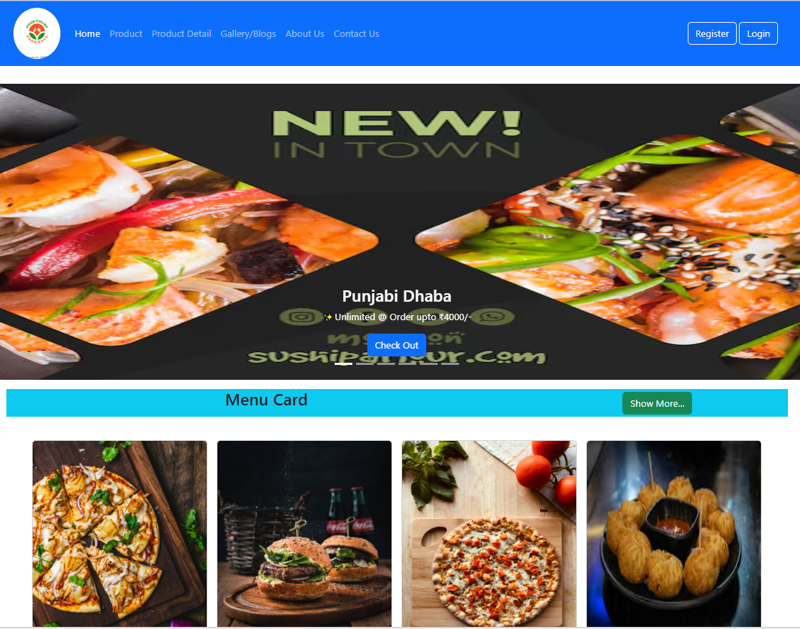
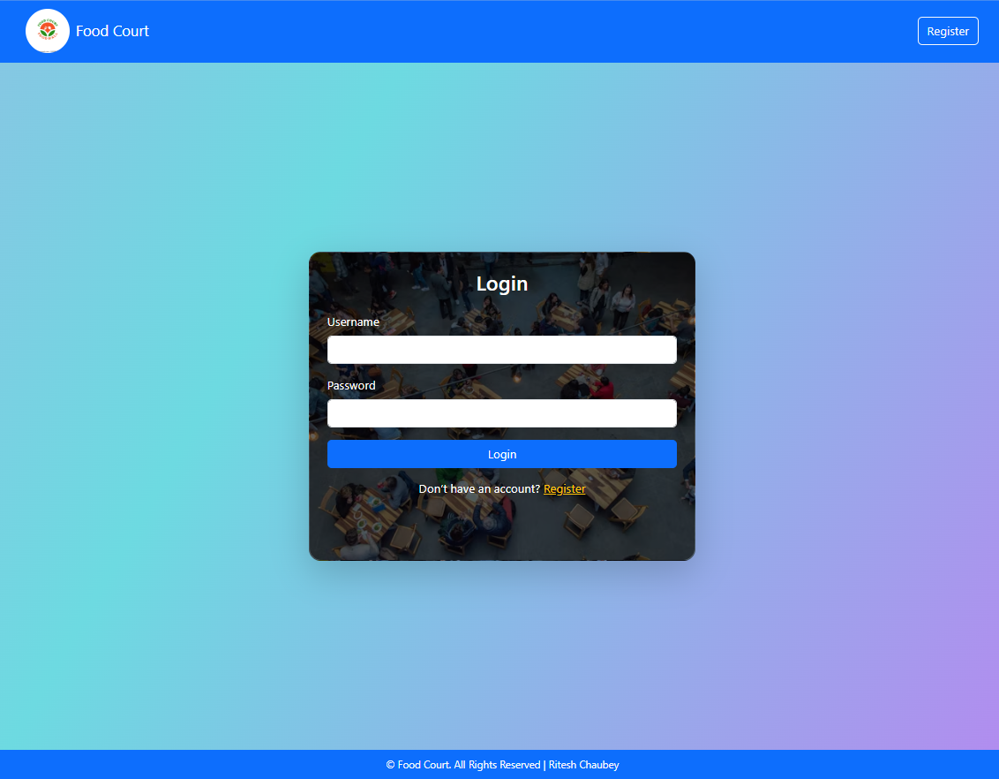
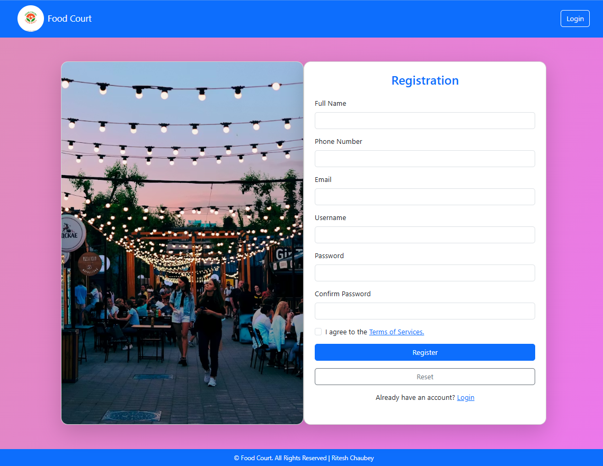
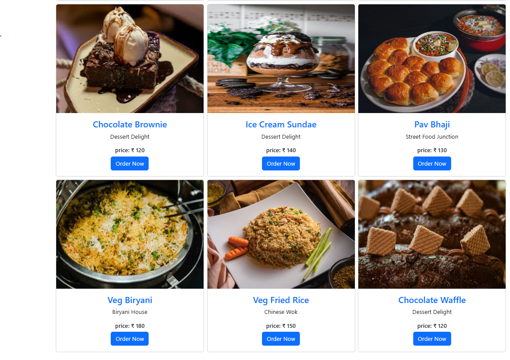
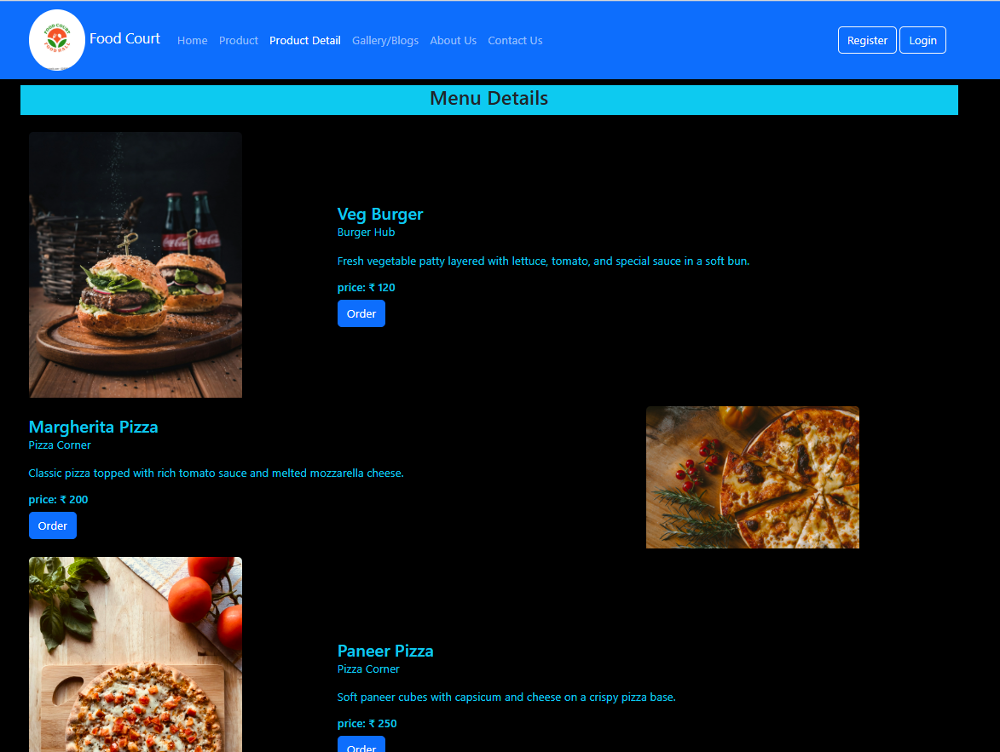
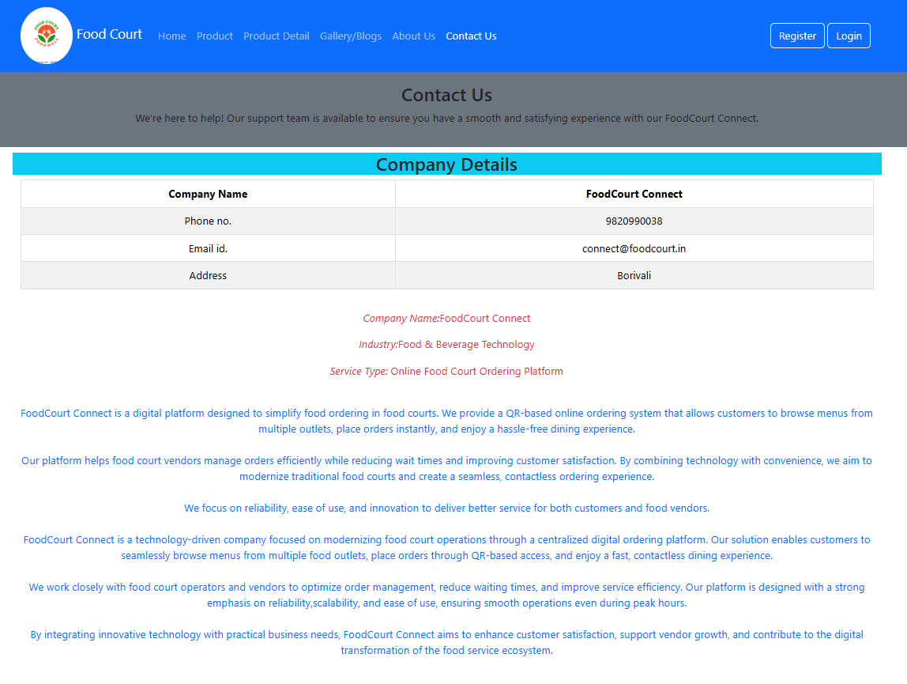

# 🍔 Foodcourt Connect

Foodcourt Connect is a simple **web-based food court interface project** where users can explore different pages such as home, products, gallery, login, and contact.
The project is built using **basic web technologies like HTML and CSS** and demonstrates the structure of a food court ordering/browsing system.

---

## 📂 Project Structure

```
Foodcourt Connect
│
├── img/
│   ├── callback.png
│   ├── contactus.png
│   ├── home.png
│   ├── login.png
│   ├── product.png
│   ├── productdetail.png
│   └── register.png
│
├── about.html
├── contact.html
├── gallery.html
├── home.html
├── index.html
├── login.html
└── product.html
```

---

## 📄 Pages Description

🏠 **index.html**
Main landing page of the website.

🏡 **home.html**
Displays the homepage content of the food court system.

ℹ️ **about.html**
Provides information about the Foodcourt Connect platform.

📞 **contact.html**
Contact page where users can reach out for support.

🖼️ **gallery.html**
Displays images related to the food court.

🔐 **login.html**
Login page for registered users.

🍽️ **product.html**
Displays available food products or menu items.

---

## 🖥️ Screenshots

### 🏠 Home Page



### 🔐 Login Page



### 📝 Register Page



### 🍔 Product Page



### 📄 Product Details



### 📞 Contact Page



### 📲 Callback Request


---

## 🛠️ Technologies Used

* 🌐 HTML
* 🎨 CSS
* 🖼️ Images for UI Design

---

## ▶️ How to Run the Project

1️⃣ Download or clone the repository
2️⃣ Open the project folder in **VS Code** or any code editor
3️⃣ Open **index.html** in your browser
4️⃣ Navigate through different pages

---

## 🎯 Purpose of the Project

This project demonstrates a **basic food court website interface** where users can explore food products and interact with different sections of the site.

It can be extended into a **complete QR-based food court ordering system** in the future.

---

🌐 Live Demo

You can view the live project here:

🔗 Foodcourt Connect Website: https://0ritesh1.github.io/UI_Food_Court/

Click the link above to explore the website hosted using GitHub Pages.

## 👨‍💻 Author

**Ritesh Chaubey**

Engineering Graduate | Web Development Enthusiast

